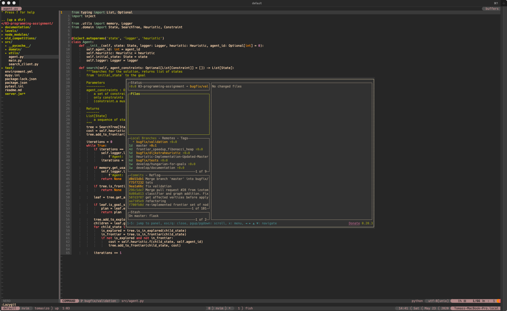

# lazygit-vim

Use lazygit in vim.



## Requrements

* [lazygit](https://github.com/jesseduffield/lazygit)
* [tmux](https://github.com/tmux/tmux)

Notes:

* lazygit-vim assumes a tmux version >= 3.2 (version that introduces `tmux popup`)

## Installation

With **[vim-plug](https://github.com/junegunn/vim-plug)**: `Plug 'tomasizo/lazygit-vim'` in your .vimrc
With **[Vundle](https://github.com/gmarik/Vundle.vim)**: `Plugin tomasizo/lazygit-vim` in your .vimrc

Add a mapping to your ~/.vimrc (change your key to suit your taste):
```bash
nnoremap <C-g> :Lazygit<CR>
```

## Usage

Assuming that your mapping is as above, and your vim runs in a tmux session,
you can just press `Ctrl+G` anytime in normal mode, and lazygit popup will
open.
